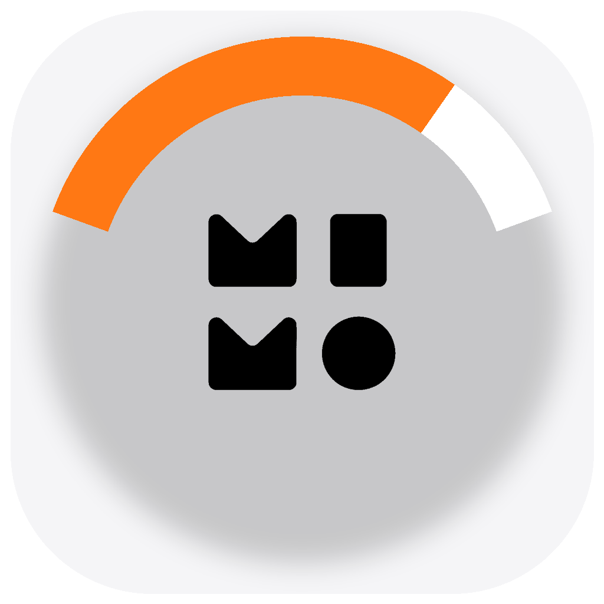

# MImoMeter

<p align="center">
  
</p>

<p align="center">
  <b>macOS 菜单栏常驻 Xiaomi MiMo 周额度余量</b>
</p>

状态栏主数字为周额度**剩余**百分比（如 `97%`）；无数据时显示 `--%`。

## 功能

- 菜单栏实时显示周额度剩余，无需打开 MiMo 设置页
- 可选提示线任务状态：黄=运行中 · 绿=10min 内完成 · 红=需要处理 · 灰=异常 · 橙=空闲
- 跟随 MiMo 启停；可设为登录启动
- 只读本地凭证，不修改 MiMo、不外传 token

## 安装

```sh
cd MImoMeter
./Scripts/build-app.sh
open ~/Applications/MImoMeter.app
```

双击 `~/Applications/MImoMeter.app` 即可。设置中可勾选「登录时启动，并跟随 MiMo」。

## 使用

| 场景 | 表现 |
| --- | --- |
| MiMo 打开 | 自动读取并显示周额度 |
| MiMo 退出 | 状态栏变为等待态（`--%`） |
| 开启提示线 | 数字下方色条反映项目任务状态 |

可选设置：周期前缀（如 `W 97%`）、1–9% 红字、展示提示线、刷新间隔、API Base。

## 开发

```sh
swift run MImoMeter --run-self-tests    # 纯逻辑自检（无网络）
swift run MImoMeter --fetch-once        # 真实 SSO + usage 一次
swift run MImoMeter --task-status-once  # 实时任务状态一次
swift run MImoMeter                     # 启动菜单栏（开发用）
```

## 数据路径

1. **本地桥探测（预留）**  
   `GET http://127.0.0.1:<port>/v1/user/usage`（Bearer）  
   当前 **404** → 静默回落平台 API。

2. **平台 API（主路径）**  
   只读本机 MiMo 账号分区 cookies → `sid=mimopc` 两阶段 SSO → `serviceToken`  
   → `GET {apiBase}/user/usage`。  
   `percent` 为**剩余**百分比；`resetAt`（Unix 秒）优先于 `resetDate`。

默认 `apiBase`：`https://mimo-server-cn.xiaomimimo.com/api`  
可用环境变量 `MIMO_API_BASE_URL` 或设置窗覆盖。

任务状态来自本地桥 `sessions` / `messages`（15s 轮询），与额度刷新解耦。

## 安全边界

- 只读本机 MiMo userData 下配置/cookies；**不修改** MiMo 目录任何文件
- 不外传凭证；token 仅存内存（缓存约 30 分钟），不写日志
- 仅请求 `127.0.0.1` 与已知 `*.xiaomimimo.com`
- 无子进程、不注入 MiMo 进程

## 卸载

1. 菜单「退出 MImoMeter」
2. 关闭登录项（系统设置 → 通用 → 登录项）
3. 删除 `~/Applications/MImoMeter.app`

## TODO

- [ ] 多任务并发测试（多会话同时运行 / 权限 / 成功切换）
- [ ] 迁移 Windows 版（系统托盘 + 等价本地桥读取）

## 文档

- 设计规格：`../docs/compose/spec/mimo-meter.md`
- 协议契约：`docs/PROTOCOL.md`
- 架构说明：`docs/ARCHITECTURE.md`
